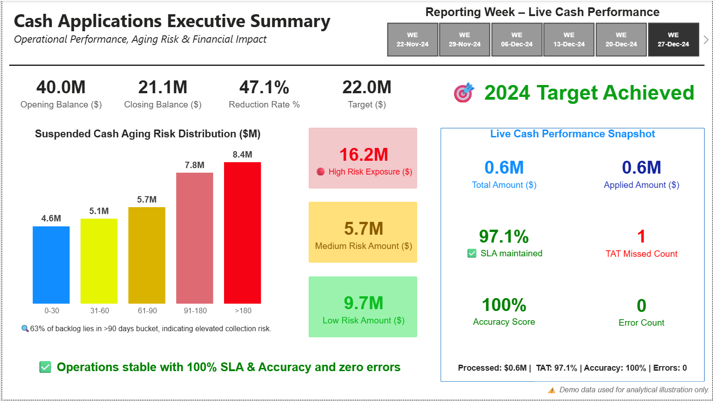
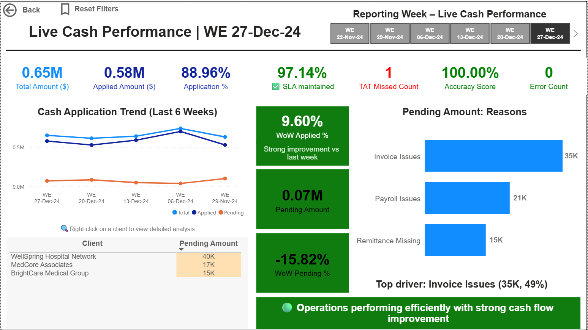
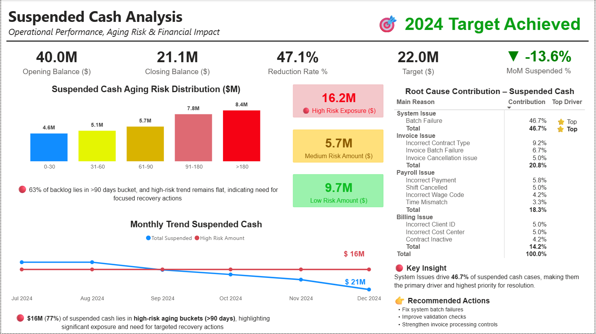
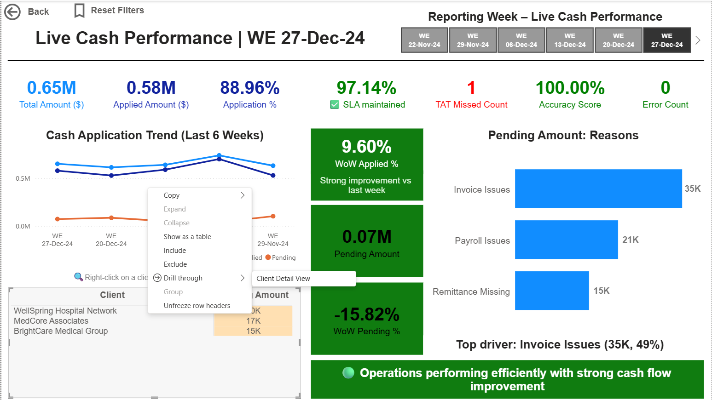

# Cash Applications Executive Dashboard (Power BI)

## 🎯 Problem Statement
Cash Applications teams often rely on multiple reports to track performance, identify risks, and analyze root causes.  
This project aims to provide a unified dashboard to enable faster decision-making and operational efficiency.

## 📊 Overview
This project showcases an end-to-end Power BI dashboard designed to monitor Cash Applications performance, identify risk, and analyze root causes of suspended cash.

## 🚀 Key Features
- Executive KPI tracking (Opening, Closing, Reduction %)
- Aging risk analysis with focus on >90 days buckets
- Root cause contribution analysis
- Live operational performance (SLA, Accuracy, Application %)
- Weekly trend analysis with WoW insights
- Client-level drill-through for detailed investigation
- Smart tooltips and contextual insights

## 💡 Key Insights
- 77% of suspended cash lies in high-risk aging buckets
- System and Invoice issues are major contributors
- Operations performing efficiently with high SLA adherence

## 🛠️ Tools & Technologies
- Power BI
- DAX
- Data Modeling
- Drill-through & Tooltips

## 📸 Dashboard Preview
## 📸 Dashboard Preview

### Executive Summary

### Live Cash Performance

### Suspended Cash Analysis

### Client Drill-through

## 🎯 Business Impact
This dashboard enables better decision-making by highlighting risk areas, identifying key drivers, and providing actionable insights for process improvement.

## 🧠 Learnings
- Designed business-driven KPIs for operational monitoring  
- Implemented DAX measures for WoW and contribution analysis  
- Built drill-through and tooltips for enhanced user experience  
- Focused on storytelling through data visualization  
